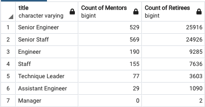

# Pewlett-Hackard-Analysis

## Overview of the Analysis: 

The goal of this analysis was to determine the number of retiring employees by title, and identify employees who are eligible to participate in a mentorship program. Additionally, arm Pewlett Hackard management with data in preparation for the upcoming surge in retirements.

### Entity Relationship Diagram


### The SQL Queries Used

This first query pulls a list of employee information that ensures:
     - The employee is still actively employed
     - The employee's birth date is between 01-JAN-1952 and 31-DEC-1955
     - The table is filtered to display unique employee values only (via the DISTINCT ON clause)

```sql
SELECT DISTINCT ON (emp.emp_no) emp.emp_no, emp.first_name, emp.last_name, t.title
INTO unique_titles
FROM employees as emp 
    INNER JOIN titles AS t 
        ON emp.emp_no = t.emp_no
-- Filtering to determine employees at retirement age
WHERE emp.birth_date BETWEEN '1952-01-01' AND '1955-12-31'
--Filtering to determine employees that still are employed
	AND t.to_date = '9999-01-01'
ORDER BY emp.emp_no, t.to_date DESC;
```
The next query returns a count of upcoming retirees by title
```sql
SELECT COUNT(emp_no) AS "Count", title
INTO retiring_titles
FROM unique_titles
GROUP BY title
ORDER BY "Count" DESC
```
The final query yields an employee list deemed eligible for mentorship - meaning they are roughly 10 or so years away from the targeted retirement age.
```sql
SELECT DISTINCT ON (emp.emp_no)
		emp.emp_no,
		emp.first_name, 
		emp.last_name, 
		emp.birth_date,
		de.from_date,
		de.to_date,
		t.title
INTO mentorship_eligibility
FROM dept_emp as de 
	INNER JOIN employees as emp 
		ON de.emp_no = emp.emp_no
	INNER JOIN titles as t
		ON t.emp_no = emp.emp_no
-- Filter to ensure the employees are currently employed
WHERE t.to_date = '9999-01-01'
-- Filter to ensure the employees were born in 1965
	AND emp.birth_date BETWEEN '1965-01-01' AND '1965-12-31'
ORDER BY emp.emp_no
```

## Results: 

Four key observations derived from this analysis:

- There are a total of **72,458** employees falling within the retirement range, with birthdate ranging from 1952-1955

  - 

- This upcoming wave, when compared to the total active employees (240,124) represents **30% of the current workforce**.

  - 

- Out of the 72k retiring, **36,291** are engineers

  - 

  - 
- As noted above, management will be easier to account for, as there are only 2 slated for retirement. 

## Summary: 

**Question**: How many roles will need to be filled as the "silver tsunami" begins to make an impact?

* 72,458 roles will need to be replaced, with 36,291 being engineering roles making up 50% of future retirees.
* A suggested query to return the total count of active employees:

```sql
SELECT COUNT(DISTINCT emp.emp_no) as count
FROM employees as emp
INNER JOIN titles ON titles.emp_no = emp.emp_no
WHERE to_date = '9999-01-01'
```
* Additionally, a suggested query to return a grouping of job titles (as long as there is a commonality between them):

```sql
SELECT COUNT(emp_no) as "Count of Engineers Retiring"
FROM unique_titles
WHERE title LIKE '%Engineer'
```


**Question**: Are there enough qualified, retirement-ready employees in the departments to mentor the next generation of Pewlett Hackard employees?

No, there is a considerable gap in mentors vs. retirees, as suggest by the following query:

First, a new table was created to hold all current, active employees and their titles:

```sql
SELECT DISTINCT ON (emp.emp_no)
		emp.emp_no,
		emp.first_name, 
		emp.last_name, 
		emp.birth_date,
		de.from_date,
		de.to_date,
		t.title
INTO me_v_rt
FROM dept_emp as de 
	INNER JOIN employees as emp 
		ON de.emp_no = emp.emp_no
	INNER JOIN titles as t
		ON t.emp_no = emp.emp_no
WHERE t.to_date = '9999-01-01'
ORDER BY emp.emp_no
```

Then, create a query that uses the `CASE` statement to run multiple conditions:

```sql
SELECT
    title,
    COUNT(CASE
            WHEN birth_date BETWEEN '1965-01-01' AND '1965-12-31'
                THEN birth_date
            ELSE NULL
            END) AS "Count of Mentors",
    COUNT(CASE
            WHEN birth_date BETWEEN '1952-01-01' AND '1955-12-31'
                THEN birth_date
            ELSE NULL
            END) AS "Count of Retirees"
FROM me_v_rt
GROUP BY title
ORDER BY "Count of Retirees" DESC
```

The result:

  - 

